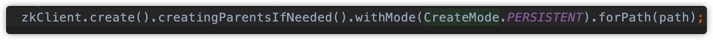

# netty-study
Java 网编 netty 部分学习

源码 source 目录下包括

- Java-Socket-chatroom：BIO Socket 聊天室
- nettystudy：netty 学习笔记代码
- simple-rpc-framework：手写的简易版 rpc 框架
- rpc-framework：跟着 [guide-rpc-framework](https://github.com/Snailclimb/guide-rpc-framework) 手打的一个较完整版的 rpc 框架

  - 自实现 rpc 框架**服务注册到 Zookeeper 的节点类型**

    首先了解一下 Zookeeper 的节点类型：

    - 短暂 (ephemeral) ：客户端和服务器端断开连接后，创建的节点自己删除
    - 持久 (persistent) ：客户端和服务器端断开连接后，创建的节点不删除

    之前没有花时间仔细了解过 Zookeeper，完成项目时只是将其作为注册中心实现，注册的为**持久节点** (因为在关闭服务后还查看过具体节点信息，发现仍然存在)

    仔细想想的话应该还是要使用 **临时节点** 进行存储，不然服务掉线后仍然能查找到当前节点的地址，消费端调用会失败

    过不其然查看代码后发现确实是创建的持久节点

    

    定义的节点类型，具体描述可参考 [博客](https://www.cnblogs.com/wzlbigdata/p/8404870.html) 

    ```java
    PERSISTENT(0, false, false, false, false),
    PERSISTENT_SEQUENTIAL(2, false, true, false, false),
    EPHEMERAL(1, true, false, false, false),
    EPHEMERAL_SEQUENTIAL(3, true, true, false, false),
    CONTAINER(4, false, false, true, false),
    PERSISTENT_WITH_TTL(5, false, false, false, true),
    PERSISTENT_SEQUENTIAL_WITH_TTL(6, false, true, false, true);
    ```

    所以对于服务的注册应该使用为其创建临时节点，当服务掉线后，它和 Zookeeper 之间的网络中断了，于是 Zookeeper 会无法向它发送心跳包，最终 Zookeeper 会认为 session expired 了，从而会把它注册的临时节点给移除掉

    进而可以产生一个新的问题，服务只是短暂掉线，当 Zookeeper 移除节点后服务上线后会涉及一个重新注册到 Zookeeper 到问题，具体可参考 [博客](https://www.codelast.com/%E5%8E%9F%E5%88%9B-zookeeper%E6%B3%A8%E5%86%8C%E8%8A%82%E7%82%B9%E7%9A%84%E6%8E%89%E7%BA%BF%E8%87%AA%E5%8A%A8%E9%87%8D%E6%96%B0%E6%B3%A8%E5%86%8C%E5%8F%8A%E6%B5%8B%E8%AF%95%E6%96%B9%E6%B3%95/)

  - 如何保证服务存活

    通过上述问题，已经可以明确了解是如何实现的了

    1. 心跳检活：服务提供者主动发心跳，或注册中心向服务提供者发心跳
    2. 临时节点：Zookeeper 的临时节点的特性，可以让不同的进程都在 Zookeeper 的一个指定节点下创建临时子节点，**不同的进程直接可以根据这个临时子节点来判断对应的进程是否存活**；服务消费者会去监听相应路径(Zookeeper 某个节点)，**一旦路径上的数据有任务变化(增加或减少)，Zookeeper 都会通知服务消费方服务提供者地址列表已经发生改变**，从而进行更新

note 笔记，简单总结
